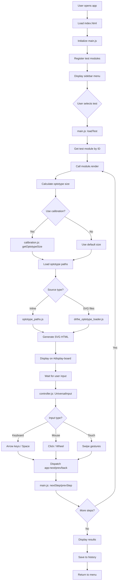
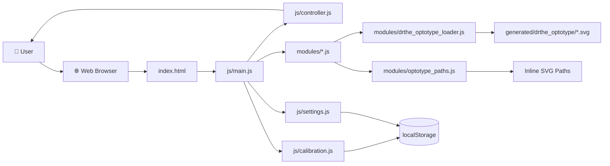
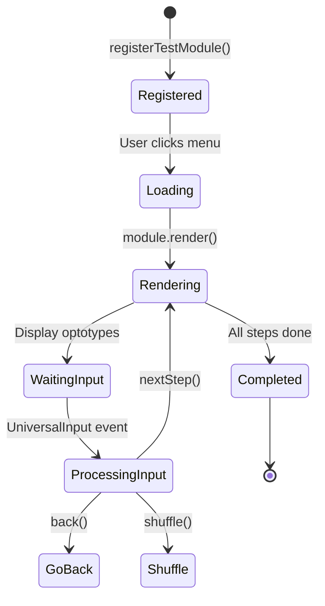
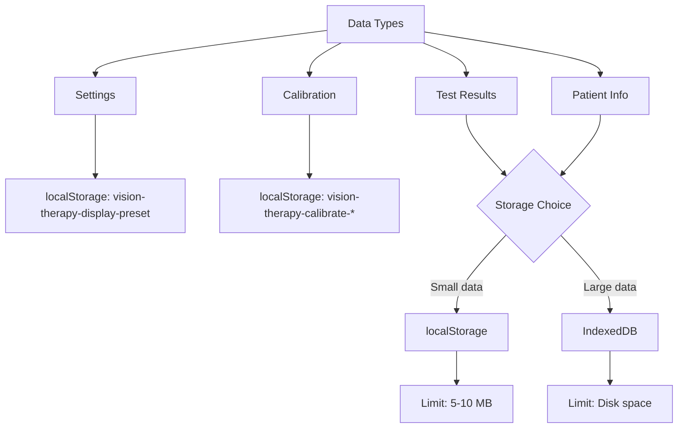

# Vision Therapy Web Application - Project Plan

## Project Overview

Hệ thống Bảng đo thị lực và chức năng thị giác là một ứng dụng web toàn diện được thiết kế để hỗ trợ chẩn đoán và điều trị nhãn khoa. Dự án bao gồm:

- **Frontend Web App**: Ứng dụng đơn trang (SPA) sử dụng HTML5, CSS3, và JavaScript ES6+ modules
- **Python Module**: Hệ thống kiểm tra thần kinh nhãn khoa độc lập sử dụng Pygame
- **Optotype Assets**: Thư viện SVG optotypes chuẩn y khoa (Sloan, LEA, Landolt C, Tumbling E, HOTV, Auckland)

### Mục tiêu dự án
Xây dựng một công cụ đo thị lực kỹ thuật số chính xác, tuân thủ chuẩn lâm sàng (LogMAR, Snellen), hỗ trợ đa nền tảng và tối ưu hóa trải nghiệm người dùng cho bác sĩ nhãn khoa và bệnh nhân.

---

## Tech Stack

### Frontend (Web Application)
- **Core**: Vanilla JavaScript (ES6+ Modules)
- **Styling**: CSS3 với CSS Variables, Flexbox, Grid
- **Graphics**: SVG (Scalable Vector Graphics) cho optotypes
- **Storage**: localStorage cho cài đặt và hiệu chuẩn
- **Architecture**: Module-based với dynamic imports

### Python Module (Neuro-Ophthalmology)
- **Framework**: Pygame 2.0+
- **Graphics**: Hardware acceleration với VSync
- **Display**: Fullscreen với double buffering

### Development Tools
- **Version Control**: Git
- **Package Management**: Không yêu cầu (client-side only)
- **Build Tools**: Không yêu cầu (native ES6 modules)

---

## System Architecture

### Directory Structure
```
vision-therapy-webapp/
├── index.html              # Entry point
├── css/                   # Stylesheets
│   ├── style.css         # Main styles
│   └── credit_card_calibration.css
├── js/                   # Core JavaScript
│   ├── main.js          # Application entry & state management
│   ├── controller.js    # UniversalInput (keyboard/mouse/touch)
│   ├── calibration.js   # Display calibration & PPI calculation
│   ├── settings.js      # Display presets management
│   └── credit_card_calibration.js
├── modules/              # Test modules (30+ modules)
│   ├── etdrs_chart.js   # ETDRS LogMAR chart
│   ├── snellen_chart.js
│   ├── landolt_c.js
│   ├── tumbling_e.js
│   ├── hotv.js
│   ├── lea_symbols.js
│   ├── near_logmar.js   # Near vision tests
│   ├── duochrome_test.js
│   ├── worth4dot.js
│   ├── stereo_anaglyph.js  # Stereo Random-Dot (Anaglyph) with WebGL
│   └── ... (20+ more modules)
├── generated/            # Generated optotype assets
│   ├── drthe_optotype/  # SVG optotypes (Sloan, Numbers, Auckland)
│   ├── optotypes.json   # Optotype metadata
│   └── ishihara_color_test/
├── neuro_ophthalmology/ # Python module
│   ├── main.py
│   ├── calibration.py
│   ├── ui.py
│   └── ...
└── plans/               # Project planning documents
```

---

## Data Flow Analysis

### Vision Testing Workflow



### Optotype Sizing Algorithm

The core of the vision testing system is the accurate sizing of optotypes based on LogMAR values:

**Formula** (from [`js/calibration.js:63-88`](js/calibration.js:63)):
```
1. arcminutes = 5 × 10^LogMAR
2. radians = (arcminutes / 60) × (π / 180)
3. height_mm = distance_mm × tan(radians)
4. height_px = height_mm × (PPI / 25.4)
```

**Calibration Priority** ([`js/calibration.js:106-112`](js/calibration.js:106)):
1. Credit card calibration (most accurate) - `ccPxPerMm` from localStorage
2. Screen height input (mm)
3. Diagonal screen size input (inches)
4. Estimated PPI from `window.screen`

---

## Current Status Analysis

### ✅ Completed Modules

#### Core Framework
- [x] **State Management** ([`js/main.js:43-55`](js/main.js:43)) - Centralized state với history stack
- [x] **Module Registry** ([`js/main.js:130-147`](js/main.js:130)) - Dynamic test loading system
- [x] **Universal Input Controller** ([`js/controller.js:65-96`](js/controller.js:65)) - Keyboard/mouse/touch support
- [x] **Display Calibration** ([`js/calibration.js:1-844`](js/calibration.js:1)) - PPI calculation, distance setting
- [x] **Credit Card Calibration** ([`js/credit_card_calibration.js`](js/credit_card_calibration.js)) - Physical calibration
- [x] **Settings Management** ([`js/settings.js:48-334`](js/settings.js:48)) - Display presets

#### Vision Test Modules (Far)
- [x] **ETDRS Chart** ([`modules/etdrs_chart.js`](modules/etdrs_chart.js)) - LogMAR with Sloan letters
- [x] **Snellen Chart** ([`modules/snellen_chart.js`](modules/snellen_chart.js))
- [x] **LEA Symbols** ([`modules/lea_symbols.js`](modules/lea_symbols.js))
- [x] **Landolt C** ([`modules/landolt_c.js`](modules/landolt_c.js))
- [x] **Tumbling E** ([`modules/tumbling_e.js`](modules/tumbling_e.js))
- [x] **HOTV** ([`modules/hotv.js`](modules/hotv.js))
- [x] **Numbers Chart** ([`modules/number_chart.js`](modules/number_chart.js))
- [x] **Auckland LogMAR** ([`modules/auckland_logmar.js`](modules/auckland_logmar.js))

#### Vision Test Modules (Near)
- [x] **Near LogMAR** ([`modules/near_logmar.js`](modules/near_logmar.js))
- [x] **Near N-point** ([`modules/near_npoint.js`](modules/near_npoint.js))
- [x] **Near LEA** ([`modules/near_lea.js`](modules/near_lea.js))

#### Specialized Tests
- [x] **Worth 4 Dot** ([`modules/worth4dot.js`](modules/worth4dot.js)) - Binocular vision
- [x] **Duochrome Test** ([`modules/duochrome_test.js`](modules/duochrome_test.js)) - Color discrimination
- [x] **Red Desaturation** ([`modules/red_desat.js`](modules/red_desat.js))
- [x] **Astigmatism** ([`modules/astigmatism.js`](modules/astigmatism.js))
- [x] **JCC Simulation** ([`modules/astigmatism_jcc.js`](modules/astigmatism_jcc.js))
- [x] **Neuro OKN** ([`modules/neuro_okn.js`](modules/neuro_okn.js)) - Optokinetic nystagmus
- [x] **Crosstalk** ([`modules/crosstalk.js`](modules/crosstalk.js))
- [x] **Stereo Random-Dot (Anaglyph)** ([`modules/stereo_anaglyph.js`](modules/stereo_anaglyph.js)) - WebGL-based RDS with Red/Cyan channels

#### Retina/Color Vision
- [x] **Amsler Grid** (in [`modules/retina_subs.js`](modules/retina_subs.js))
- [x] **Ishihara Test** (in [`modules/retina_subs.js`](modules/retina_subs.js))
- [x] **Pelli-Robson** (in [`modules/retina_subs.js`](modules/retina_subs.js))

#### Optotype Assets
- [x] **Sloan Letters** (10 letters in [`generated/drthe_optotype/sloan/`](generated/drthe_optotype/sloan/))
- [x] **Numbers** (0-9 in [`generated/drthe_optotype/numbers/`](generated/drthe_optotype/numbers/))
- [x] **Auckland Symbols** (10 symbols in [`generated/drthe_optotype/Auckland/`](generated/drthe_optotype/Auckland/))
- [x] **Inline Optotype Paths** ([`modules/optotype_paths.js`](modules/optotype_paths.js))

---

### ⚠️ Incomplete / Missing Features

#### Critical Missing Features
1. **Test Results Management**
   - [ ] Không có hệ thống lưu trữ kết quả kiểm tra
   - [ ] Không có patient management system
   - [ ] Không có khả năng xuất kết quả (PDF, CSV, JSON)

2. **Data Persistence**
   - [ ] Test history chỉ lưu trong session (state.history)
   - [ ] Không có database hoặc cloud sync
   - [ ] Thiếu tính năng xuất/nhập dữ liệu bệnh nhân

3. **User Experience Improvements**
   - [ ] Hướng dẫn sử dụng chi tiết (user guide)
   - [ ] Tooltip/Giải thích cho từng bài kiểm tra
   - [ ] Chế độ demo/hướng dẫn cho người mới
   - [ ] Đa ngôn ngữ (hiện tại chỉ có tiếng Việt một phần)

4. **Clinical Features**
   - [ ] Scoring system cho mỗi bài test
   - [ ] Tự động tính toán thị lực cuối cùng
   - [ ] So sánh kết quả giữa các lần khám
   - [ ] Biểu đồ tiến triển thị lực

5. **Print/Export Functionality**
   - [ ] In kết quả ra PDF
   - [ ] Xuất báo cáo lâm sàng
   - [ ] Chia sẻ kết quả qua email

6. **Python Module Integration**
   - [ ] Python module (neuro_ophthalmology) hoàn toàn tách biệt với web app
   - [ ] Không có cơ chế giao tiếp giữa web app và Python module
   - [ ] Cần tích hợp hoặc làm rõ mục đích sử dụng

#### Technical Debt
1. **Code Quality**
   - [ ] Một số module chưa có đầy đủ comments/documentation
   - [ ] Chưa có unit tests
   - [ ] Chưa có error handling toàn diện

2. **Performance**
   - [ ] Optotype loader chưa có preload mechanism
   - [ ] Một số SVG có thể tối ưu hóa kích thước
   - [ ] Chưa có lazy loading cho modules

3. **Browser Compatibility**
   - [ ] Chưa test đầy đủ trên các trình duyệt
   - [ ] Chưa có polyfills cho trình duyệt cũ
   - [ ] Responsive design chưa tối ưu cho mobile

---

## Actionable Tasks

### Phase 1: Stabilization & Core Features (Priority: HIGH)

#### Task 1.1: Implement Test Results Management System
**Description**: Xây dựng hệ thống quản lý kết quả kiểm tra thị lực  
**Files to create/modify**:
- `js/results-manager.js` (new)
- `js/main.js` (modify: integrate with state)
- `index.html` (add: results view)

**Steps**:
1. Tạo `ResultsManager` class để lưu trữ kết quả (localStorage hoặc IndexedDB)
2. Định nghĩa cấu trúc dữ liệu kết quả (test ID, date, LogMAR, Snellen, responses)
3. Tích hợp vào `main.js` để tự động lưu khi hoàn thành bài test
4. Tạo giao diện xem lịch sử kết quả
5. Thêm chức năng xóa/xuất kết quả

**Estimated complexity**: Medium

---

#### Task 1.2: Add Patient Management System
**Description**: Hệ thống quản lý thông tin bệnh nhân  
**Files to create/modify**:
- `js/patient-manager.js` (new)
- `index.html` (add: patient registration modal)
- `css/style.css` (add: patient form styles)

**Steps**:
1. Tạo `PatientManager` class với CRUD operations
2. Thiết kế form nhập thông tin bệnh nhân (tên, tuổi, ID, ngày khám)
3. Lưu trữ dữ liệu bệnh nhân (localStorage hoặc IndexedDB)
4. Hiển thị thông tin bệnh nhân hiện tại trên UI
5. Tích hợp với results manager

**Estimated complexity**: Medium

---

#### Task 1.3: Implement Export/Print Functionality
**Description**: Cho phép xuất kết quả ra PDF/CSV/In trực tiếp  
**Files to create/modify**:
- `js/export-manager.js` (new)
- `index.html` (add: export buttons)

**Steps**:
1. Sử dụng thư viện jsPDF hoặc tương đương để tạo PDF
2. Tạo template báo cáo lâm sàng chuẩn
3. Thêm chức năng xuất CSV cho dữ liệu thô
4. Tích hợp Web Print API cho in trực tiếp
5. Thêm nút xuất/print vào giao diện kết quả

**Estimated complexity**: Medium-High

---

### Phase 2: User Experience & Clinical Features (Priority: MEDIUM)

#### Task 2.1: Create Comprehensive User Guide
**Description**: Viết hướng dẫn sử dụng chi tiết cho bác sĩ và bệnh nhân  
**Files to create/modify**:
- `USER_GUIDE.md` (new)
- `index.html` (add: help button/modal)
- `css/style.css` (add: help modal styles)

**Steps**:
1. Phân tích quy trình sử dụng thực tế tại phòng khám
2. Viết hướng dẫn từng bước cho từng bài test
3. Tạo hình ảnh minh họa/diagram
4. Thêm video hướng dẫn (nếu cần)
5. Tích hợp vào ứng dụng dưới dạng modal/overlay

**Estimated complexity**: Low-Medium

---

#### Task 2.2: Add Scoring System & Auto-Calculation
**Description**: Tự động tính toán điểm số và thị lực cuối cùng  
**Files to create/modify**:
- Các file `modules/*.js` (modify: add scoring logic)
- `js/main.js` (modify: aggregate scores)

**Steps**:
1. Định nghĩa thuật toán tính điểm cho từng loại bài test
2. Thêm logic ghi nhận câu trả lời đúng/sai
3. Tự động tính LogMAR trung bình khi hoàn thành
4. Hiển thị kết quả tổng hợp rõ ràng
5. Lưu điểm số vào results manager

**Estimated complexity**: Medium

---

#### Task 2.3: Implement Progress Tracking & Charts
**Description**: Biểu đồ theo dõi tiến triển thị lực theo thời gian  
**Files to create/modify**:
- `js/progress-chart.js` (new) - sử dụng Chart.js hoặc tương đương
- `index.html` (add: progress view)
- `css/style.css` (add: chart styles)

**Steps**:
1. Tích hợp thư viện vẽ biểu đồ (Chart.js, D3.js)
2. Tạo biểu đồ thị lực theo thời gian
3. So sánh kết quả giữa các lần khám
4. Thêm bộ lọc theo khoảng thời gian
5. Hiển thị xu hướng cải thiện/thuyên giảm

**Estimated complexity**: Medium-High

---

### Phase 3: Integration & Advanced Features (Priority: LOW)

#### Task 3.1: Integrate Python Module with Web App
**Description**: Tích hợp hoặc làm rõ vai trò của Python module  
**Files to create/modify**:
- `neuro_ophthalmology/` (restructure or integrate)
- Có thể tạo bridge (WebSocket, REST API) hoặc giữ tách biệt

**Options**:
1. **Option A**: Giữ tách biệt, tạo launcher để chạy Python module khi cần
2. **Option B**: Chuyển đổi Python module sang JavaScript
3. **Option C**: Tạo local server (Flask/FastAPI) và giao tiếp qua API

**Steps**:
1. Đánh giá tính năng của Python module
2. Quyết định phương án tích hợp
3. Implement bridge hoặc conversion
4. Test kỹ lưỡng

**Estimated complexity**: High

---

#### Task 3.2: Add Multi-language Support (i18n)
**Description**: Hỗ trợ đa ngôn ngữ (Tiếng Việt, English, Chinese, etc.)  
**Files to create/modify**:
- `js/i18n.js` (new)
- `locales/` directory (new: vi.json, en.json, etc.)
- Tất cả file HTML/JS (modify: replace hardcoded strings)

**Steps**:
1. Tạo hệ thống i18n framework đơn giản
2. Trích xuất tất cả chuỗi văn bản ra file JSON
3. Dịch sang các ngôn ngữ mục tiêu
4. Thêm switcher ngôn ngữ vào Settings
5. Lưu preference vào localStorage

**Estimated complexity**: Medium

---

#### Task 3.3: Optimize Performance & Add PWA Support
**Description**: Tối ưu hóa hiệu năng và biến thành Progressive Web App  
**Files to create/modify**:
- `manifest.json` (new)
- `service-worker.js` (new)
- `js/main.js` (modify: add preload logic)

**Steps**:
1. Thêm Web App Manifest
2. Implement Service Worker cho offline support
3. Preload optotype assets
4. Tối ưu hóa SVG (minify, compress)
5. Lazy load modules chưa dùng đến
6. Test Performance với Lighthouse

**Estimated complexity**: Medium

---

### Phase 4: Testing & Documentation (Priority: ONGOING)

#### Task 4.1: Write Unit Tests
**Description**: Viết unit tests cho core modules  
**Files to create**:
- `tests/` directory
- `tests/calibration.test.js`
- `tests/controller.test.js`
- `tests/optotype_paths.test.js`

**Steps**:
1. Chọn testing framework (Jest, Mocha, hoặc native)
2. Viết tests cho calibration.js (getOptotypeSize function)
3. Viết tests cho controller.js (UniversalInput events)
4. Viết tests cho optotype_paths.js
5. Setup CI/CD để chạy tests tự động

**Estimated complexity**: Medium

---

#### Task 4.2: Cross-browser Testing & Compatibility
**Description**: Đảm bảo ứng dụng chạy tốt trên mọi trình duyệt  
**Steps**:
1. Test trên Chrome, Firefox, Safari, Edge
2. Test trên Windows, macOS, Linux
3. Test trên mobile browsers (iOS Safari, Android Chrome)
4. Fix compatibility issues
5. Thêm polyfills nếu cần
6. Document known issues

**Estimated complexity**: Medium

---

#### Task 4.3: Complete Documentation
**Description**: Hoàn thiện tài liệu dự án  
**Files to create/modify**:
- `README.md` (update)
- `API.md` (new - document module interfaces)
- `CONTRIBUTING.md` (new)
- `CHANGELOG.md` (new)

**Steps**:
1. Cập nhật README.md với thông tin đầy đủ
2. Viết tài liệu API cho developers
3. Tạo contributing guidelines
4. Tạo changelog
5. Thêm license information
6. Tạo video demo

**Estimated complexity**: Low

---

## Constraints & Considerations

### Technical Constraints
1. **Client-side Only**: Ứng dụng web chạy hoàn toàn trên browser, không có backend
   - Giới hạn lưu trữ (localStorage ~5-10MB)
   - Không có đồng bộ hóa đám mây tự động
   - Bảo mật dữ liệu phụ thuộc vào bảo mật trình duyệt

2. **Browser Compatibility**: 
   - Yêu cầu trình duyệt hỗ trợ ES6 Modules
   - SVG rendering phụ thuộc vào trình duyệt
   - Một số tính năng (Fullscreen API, Vibration API) có thể không hỗ trợ đầy đủ

3. **Display Calibration Dependency**:
   - Độ chính xác đo thị lực phụ thuộc vào hiệu chuẩn màn hình
   - Cần đảm bảo bệnh nhân đứng đúng khoảng cách
   - Màn hình quá nhỏ có thể không hiển thị optotype lớn enough

### Clinical Constraints
1. **Not for Self-Diagnosis**: Ứng dụng chỉ hỗ trợ bác sĩ, không thay thế chẩn đoán y khoa
2. **Environmental Factors**: Cần điều kiện ánh sáng chuẩn khi đo
3. **Patient Cooperation**: Kết quả phụ thuộc vào mức độ hợp tác của bệnh nhân

### Legal & Ethical Considerations
1. **Data Privacy**: Tuân thủ quy định về bảo vệ dữ liệu y tế (nếu có)
2. **Accuracy Disclaimer**: Cần cảnh báo về sai số có thể có
3. **Liability**: Làm rõ trách nhiệm khi sử dụng ứng dụng

---

## Recommended Development Workflow

### Git Workflow
```bash
main branch: Stable production code
develop branch: Integration branch
feature/* branches: New features
bugfix/* branches: Bug fixes
```

### Testing Strategy
1. **Manual Testing**: Test từng bài kiểm tra thị lực thực tế
2. **Visual Testing**: So sánh optotype rendering với chuẩn lâm sàng
3. **Calibration Testing**: Kiểm tra độ chính xác hiệu chuẩn
4. **Cross-device Testing**: Test trên các kích thước màn hình khác nhau

### Release Process
1. Test kỹ lưỡng trên môi trường local
2. Tag version theo Semantic Versioning (v1.0.0, v1.1.0, etc.)
3. Tạo release notes
4. Deploy lên GitHub Pages hoặc web server

---

## Mermaid Diagrams

### System Architecture Overview



### Test Module Lifecycle



### Data Storage Strategy



---

## Stereo Anaglyph Module Technical Documentation

### Overview
The Stereo Anaglyph module ([`modules/stereo_anaglyph.js`](modules/stereo_anaglyph.js)) implements a clinical Random Dot Stereogram (RDS) test using WebGL fragment shaders for hardware-accelerated rendering. This module enables stereopsis testing using red/cyan anaglyph glasses.

### Optical Mathematics
The module converts clinical stereo acuity measurements (arcseconds) to pixel disparities using trigonometric calculations based on the calibration data from `window.__calibrator`:

**Formula** (from [`modules/stereo_anaglyph.js:renderFrame()`](modules/stereo_anaglyph.js:renderFrame)):
```
1. radians = (arcsec / 3600.0) × (π / 180.0)
2. distanceMm = distanceM × 1000.0
3. disparityMm = tan(radians) × distanceMm
4. disparityPx = disparityMm × pxPerMm × dpr
```

Where:
- `arcsec`: Stereo acuity in arcseconds (400, 200, 100, 50, 40, 20)
- `distanceM`: Viewing distance in meters (from calibration)
- `pxPerMm`: Pixels per millimeter (from calibration)
- `dpr`: Device pixel ratio

### WebGL Implementation

#### Vertex Shader
- Creates a full-screen quad with UV coordinates
- Passes normalized coordinates to fragment shader

#### Fragment Shader
1. **Hash Function**: Generates random dots using a fast pseudo-random algorithm
2. **Shape Detection**: Determines if pixel belongs to the target shape (circle, square, triangle)
3. **Channel Separation**:
   - Red channel (left eye): Shifts right for positive disparity
   - Cyan channel (green + blue, right eye): Shifts left for positive disparity
4. **Pixel-Scale Dots**: Creates macro-pixel effect for RDS pattern

### Clinical Features
- **Stereo Acuity Range**: 400, 200, 100, 50, 40, 20 arcsec (standard clinical levels)
- **Shape Types**: Circle, Square, Triangle (for forced-choice testing methodology)
- **Anaglyph Colors**: Red/Cyan separation for retinal disparity
- **Real-time Controls**:
  - Arrow Up/Down: Change stereo threshold (increase/decrease difficulty)
  - Arrow Left/Right: Cycle through shapes (forced-choice paradigm)

### Calibration Dependency
Requires `window.__calibrator` object with:
- `pxPerMm`: Pixels per millimeter (from display calibration)
- `distanceM`: Viewing distance in meters

### Memory Management
Implements proper WebGL resource cleanup:
- Shader detachment and deletion
- Program deletion
- Buffer cleanup
- Event listener removal on module cleanup

### Clinical Application
- **Target Population**: Patients with suspected stereopsis deficits
- **Test Distance**: Typically 40cm (0.4m) for near stereopsis
- **Expected Performance**: Normal stereopsis < 40 arcsec
- **Interpretation**: Patient reports shape popping out or receding

---

## Conclusion

Dự án Vision Therapy Web Application đã có một khởi đầu tốt với kiến trúc module rõ ràng và nhiều bài kiểm tra thị lực đã được implement. Tuy nhiên, để trở thành một công cụ lâm sàng hoàn chỉnh, cần tập trung vào:

1. **Hệ thống quản lý kết quả và bệnh nhân** (Phase 1)
2. **Cải thiện trải nghiệm người dùng** (Phase 2)
3. **Tích hợp đầy đủ và tối ưu hóa** (Phase 3)
4. **Testing và documentation** (Phase 4)

Việc ưu tiên Phase 1 sẽ giúp ứng dụng có thể sử dụng thực tế trong phòng khám, trong khi các phase sau sẽ nâng cao chất lượng và tính chuyên nghiệp của sản phẩm.

---

## Appendix: File Reference Quick Links

- Entry Point: [`index.html`](index.html)
- Main Logic: [`js/main.js`](js/main.js)
- Input Controller: [`js/controller.js`](js/controller.js)
- Calibration: [`js/calibration.js`](js/calibration.js)
- Settings: [`js/settings.js`](js/settings.js)
- Optotype Loader: [`modules/drthe_optotype_loader.js`](modules/drthe_optotype_loader.js)
- Optotype Paths: [`modules/optotype_paths.js`](modules/optotype_paths.js)
- ETDRS Chart: [`modules/etdrs_chart.js`](modules/etdrs_chart.js)
- Snellen Chart: [`modules/snellen_chart.js`](modules/snellen_chart.js)

---

**Last Updated**: 2026-07-23  
**Version**: 1.0  
**Author**: System Architect (AI Assistant)
