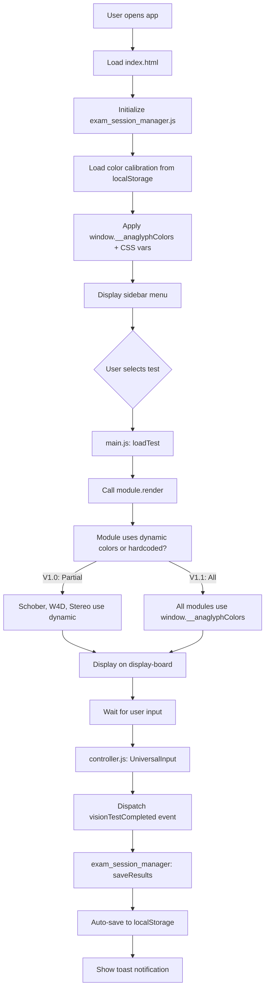

# Vision Therapy Web Application - Project Plan (Mini-EMR)

## Project Overview

Hệ thống Mini-EMR cho phòng khám nhãn khoa — ứng dụng web đơn trang (SPA) hỗ trợ quản lý phiên khám, lưu trữ hồ sơ offline, và chạy 30+ bài test thị lực chuẩn lâm sàng.

- **Frontend**: Vanilla JavaScript (ES6+ Modules), HTML5 Canvas, WebGL, SVG
- **Storage**: `localStorage` cho cài đặt, calibration, và EMR history (tối đa 200 bản ghi)
- **Architecture**: Module-based với dynamic imports, Global Event Delegation

### Mục tiêu dự án
Xây dựng công cụ đo thị lực kỹ thuật số chính xác, hoạt động offline, hỗ trợ đa nền tảng cho bác sĩ nhãn khoa.

---

## Version History

### ✅ V1.0 — STABLE (Đã hoàn thành)

#### Quản lý phiên khám (Exam Session Management)
- [x] Khởi tạo luồng nhập liệu bệnh nhân (Start Exam Modal)
- [x] Tự động tính tuổi từ năm sinh (`patientAge = currentYear - patientYOB`)
- [x] Hỗ trợ chế độ "Khám ẩn danh" (Anonymous mode)
- [x] Auto-save phiên khám vào `localStorage` (key: `vision_therapy_active_session`)
- [x] Khôi phục phiên khám sau khi reload/trang bị tắt nhầm
- [x] Enter fullscreen mode tự động khi bắt đầu khám
- [x] Keyboard shortcut `Ctrl+Space` / `F2` để lưu kết quả nhanh

#### Quản lý hồ sơ & Lịch sử (EMR History Viewer)
- [x] Lưu trữ bệnh án offline vào `localStorage` (key: `vision_emr_history_v1`)
- [x] Tối đa 200 bản ghi, tự động xóa bản ghi cũ nhất
- [x] Tìm kiếm bệnh nhân theo tên (real-time search filter)
- [x] Hiển thị thông tin: Ngày khám, Tên, Năm sinh (tuổi), Thao tác
- [x] Xem chi tiết kết quả từ lịch sử (View Report Modal)
- [x] Xuất dữ liệu ra PDF (sử dụng `html2pdf.js`)
- [x] Xuất dữ liệu ra Excel/CSV (UTF-8 BOM, key: `btn-export-csv`)

#### Giao diện Cài đặt Phòng khám (Clinic Settings)
- [x] Tự động sinh DOM cho Modal cài đặt (tránh lỗi sập UI)
- [x] Quản lý thông tin định danh: Tên phòng khám, Tên bác sĩ, Địa chỉ
- [x] Upload và quản lý Logo phòng khám (tự động nén qua Canvas)
- [x] Live Preview logo trong header báo cáo
- [x] Sử dụng Global Event Delegation đảm bảo nút Settings luôn hoạt động
- [x] Lưu cài đặt vào `localStorage` (key: `vision_clinic_settings`)

#### Hệ thống Hiệu chuẩn Kính lọc (Crosstalk Cancellation)
- [x] Bảng chọn màu động trong Modal Cài đặt:
  - 8 mức độ Đỏ: `#FF4D4D` → `#FFF0F0` (từ đậm đến nhạt)
  - 8 mức độ Lục Lam: `#4DFFFF` → `#F0FFFF` (từ đậm đến nhạt)
- [x] Lưu màu cá nhân hóa vào `localStorage` (key: `vision_color_calibration`)
- [x] Áp dụng vào biến toàn cục `window.__anaglyphColors`
- [x] Thiết lập CSS Custom Properties: `--calibrated-red`, `--calibrated-cyan`
- [x] Mã màu dự phòng an toàn (Fallback): `#FF4D4D` (Đỏ) và `#4DFFFF` (Lục Lam)
- [x] Hàm `window.refreshTestViews()` tự động re-render các bài test khi đổi màu

#### Các bài test đã tích hợp sẵn dynamic color
- [x] Schober Test (Heterophoria) — Canvas 2D render
- [x] Worth 4 Dot — SVG DOM render
- [x] Stereo Anaglyph (Random-Dot Stereogram) — WebGL RDS
- [x] Dynamic Vergence — Dual-layer CSS compositing
- [x] Dynamic Fixation — Animated fixation target

---

### 🔄 V1.1 — TODO (Sẽ làm với Model Pro)

#### Đồng bộ hóa màu động vào tất cả bài test (Crosstalk Color Sync)

**Mục tiêu**: Thay thế toàn bộ mã màu hardcode (`#FF0000`, `#00FFFF`, v.v.) bằng biến động `window.__anaglyphColors`.

##### Bước 1: Quét và thay thế hardcode colors
- [ ] Quét tất cả file `modules/*.js` tìm string pattern `#FF0000`, `#00FFFF`, `rgb\(255,0,0\)`, `rgb\(0,255,255\)`
- [ ] Thay thế bằng hàm fallback an toàn:
  ```javascript
  // Chuẩn fallback: dùng màu đã hiệu chuẩn, nếu không có thì dùng màu mặc định
  const RED   = window.__anaglyphColors?.red   || '#FF4D4D';
  const CYAN  = window.__anaglyphColors?.cyan  || '#4DFFFF';
  ```
- [ ] Ưu tiên thay thế trong các module sau:
  - [`modules/schober_test.js`](modules/schober_test.js) — Schober Heterophoria
  - [`modules/worth4dot.js`](modules/worth4dot.js) — Worth 4 Dot
  - [`modules/stereo_anaglyph.js`](modules/stereo_anaglyph.js) — Stereo Random-Dot
  - [`modules/dynamic_vergence.js`](modules/dynamic_vergence.js) — Dynamic Vergence
  - [`modules/dynamic_fixation.js`](modules/dynamic_fixation.js) — Dynamic Fixation
  - [`modules/crosstalk.js`](modules/crosstalk.js) — Crosstalk compensation matrix

##### Bước 2: Xây dựng hàm `refreshTestViews()` mở rộng
- [ ] Mở rộng hàm `window.refreshTestViews()` (đã có trong [`js/exam_session_manager.js:463-496`](js/exam_session_manager.js:463))
- [ ] Thêm logic gọi lại `render()` hoặc `init()` của từng module đang active
- [ ] Đảm bảo re-render xảy ra ngay khi người dùng bấm "Lưu cấu hình" trong Clinic Settings
- [ ] Thêm debounce (300ms) để tránh re-render quá nhiều lần

```javascript
// Pseudocode cho refreshTestViews() mở rộng
window.refreshTestViews = function() {
    // Lấy màu mới từ CSS variables
    const styles = getComputedStyle(document.documentElement);
    const red   = styles.getPropertyValue('--calibrated-red').trim() || '#FF4D4D';
    const cyan  = styles.getPropertyValue('--calibrated-cyan').trim() || '#4DFFFF';

    // Schober Test
    const schoberCanvas = document.getElementById('schober-canvas');
    if (schoberCanvas && schoberCanvas.offsetParent !== null && typeof SchoberTestRender === 'function') {
        SchoberTestRender(red, cyan);
    }

    // Worth 4 Dot
    const worthSvg = document.querySelector('.worth4dot-svg');
    if (worthSvg && typeof Worth4DotRender === 'function') {
        Worth4DotRender(red, cyan);
    }

    // Stereo Anaglyph
    const stereoCanvas = document.getElementById('stereo-canvas');
    if (stereoCanvas && stereoCanvas.offsetParent !== null && typeof StereoAnaglyphRefresh === 'function') {
        StereoAnaglyphRefresh(red, cyan);
    }

    // Dynamic Vergence
    const redLayer = document.getElementById('dv-red-layer');
    const cyanLayer = document.getElementById('dv-cyan-layer');
    if (redLayer && cyanLayer && typeof DynamicVergenceRefresh === 'function') {
        DynamicVergenceRefresh(red, cyan);
    }

    // Dynamic Fixation
    const dfContainer = document.getElementById('dynamic-fixation-container');
    if (dfContainer && dfContainer.offsetParent !== null && typeof DynamicFixationRefresh === 'function') {
        DynamicFixationRefresh(red, cyan);
    }

    console.log('[refreshTestViews] All active test views refreshed.');
};
```

##### Bước 3: Tích hợp vào saveClinicSettings()
- [ ] Đảm bảo `saveClinicSettings()` trong [`js/exam_session_manager.js:1901-1940`](js/exam_session_manager.js:1901) gọi `refreshTestViews()` SAU KHI cập nhật `window.__anaglyphColors`
- [ ] Thêm toast notification "Đã cập nhật màu cho tất cả bài test"

##### Bước 4: Testing
- [ ] Verify mỗi bài test hiển thị đúng màu sau khi đổi trong Settings
- [ ] Kiểm tra không còn hardcode color nào trong 6 module mục tiêu
- [ ] Test trên trình duyệt Chrome, Firefox, Edge

---

## System Architecture

### Directory Structure
```
vision-therapy-webapp/
├── index.html              # Entry point
├── css/                   # Stylesheets
│   ├── style.css         # Main styles
│   └── credit_card_calibration.css
├── js/                   # Core JavaScript
│   ├── main.js          # Application entry & state management
│   ├── controller.js    # UniversalInput (keyboard/mouse/touch)
│   ├── calibration.js   # Display calibration & PPI calculation
│   ├── settings.js      # Display presets management
│   ├── exam_session_manager.js  # V1.0: Exam session, EMR history, Clinic settings
│   └── credit_card_calibration.js
├── modules/              # Test modules (30+ modules)
│   ├── schober_test.js      # V1.1 target: hardcode color sync
│   ├── worth4dot.js         # V1.1 target: hardcode color sync
│   ├── stereo_anaglyph.js   # V1.1 target: hardcode color sync
│   ├── dynamic_vergence.js  # V1.1 target: hardcode color sync
│   ├── dynamic_fixation.js  # V1.1 target: hardcode color sync
│   ├── crosstalk.js         # V1.1 target: hardcode color sync
│   └── ... (24+ more modules)
├── generated/            # Generated optotype assets
└── neuro_ophthalmology/ # Python module (separate)
```

---

## Data Flow Analysis

### Vision Testing Workflow



### Color Calibration Flow

```mermaid
graph LR
    A[User opens Settings Modal] --> B[Load palette from localStorage]
    B --> C[Display 8 Red + 8 Cyan swatches]
    C --> D[User clicks swatch]
    D --> E[Update active state on swatch]
    E --> F[User clicks Save]
    F --> G[Save to localStorage: vision_color_calibration]
    G --> H[Update window.__anaglyphColors]
    H --> I[Set CSS --calibrated-red, --calibrated-cyan]
    I --> J[Call refreshTestViews]
    J --> K[Re-render all active test modules]
```



---

## Current Status Analysis

### Completed Modules (V1.0 Stable)

#### Core Framework
- [x] **State Management** ([`js/main.js`](js/main.js)) - Centralized state with history stack
- [x] **Module Registry** ([`js/main.js`](js/main.js)) - Dynamic test loading system
- [x] **Universal Input Controller** ([`js/controller.js`](js/controller.js)) - Keyboard/mouse/touch support
- [x] **Display Calibration** ([`js/calibration.js`](js/calibration.js)) - PPI calculation, distance setting
- [x] **Credit Card Calibration** ([`js/credit_card_calibration.js`](js/credit_card_calibration.js)) - Physical calibration
- [x] **Settings Management** ([`js/settings.js`](js/settings.js)) - Display presets (Standard, High Contrast, Low Glare)

#### Exam Session Manager (V1.0 New)
- [x] **Exam Session Management** ([`js/exam_session_manager.js`](js/exam_session_manager.js)) - Patient intake, auto-age calculation, session persistence
- [x] **EMR History Viewer** ([`js/exam_session_manager.js`](js/exam_session_manager.js)) - Search, view, PDF export, CSV/Excel export
- [x] **Clinic Settings Modal** ([`js/exam_session_manager.js`](js/exam_session_manager.js)) - Dynamic DOM generation, logo upload, live preview
- [x] **Crosstalk Color Calibration** ([`js/exam_session_manager.js`](js/exam_session_manager.js)) - 8-shade palette, localStorage persistence, CSS variable injection
- [x] **Global refreshTestViews()** ([`js/exam_session_manager.js:463-496`](js/exam_session_manager.js:463)) - Re-render active tests after color change

#### Vision Test Modules (Far)
- [x] **ETDRS Chart** ([`modules/etdrs_chart.js`](modules/etdrs_chart.js))
- [x] **Snellen Chart** ([`modules/snellen_chart.js`](modules/snellen_chart.js))
- [x] **LEA Symbols** ([`modules/lea_symbols.js`](modules/lea_symbols.js))
- [x] **Landolt C** ([`modules/landolt_c.js`](modules/landolt_c.js))
- [x] **Tumbling E** ([`modules/tumbling_e.js`](modules/tumbling_e.js))
- [x] **HOTV** ([`modules/hotv.js`](modules/hotv.js))
- [x] **Numbers Chart** ([`modules/number_chart.js`](modules/number_chart.js))
- [x] **Auckland LogMAR** ([`modules/auckland_logmar.js`](modules/auckland_logmar.js))

#### Vision Test Modules (Near)
- [x] **Near LogMAR** ([`modules/near_logmar.js`](modules/near_logmar.js))
- [x] **Near N-point** ([`modules/near_npoint.js`](modules/near_npoint.js))
- [x] **Near LEA** ([`modules/near_lea.js`](modules/near_lea.js))

#### Specialized Tests
- [x] **Worth 4 Dot** ([`modules/worth4dot.js`](modules/worth4dot.js)) - Binocular vision (dynamic color ready)
- [x] **Duochrome Test** ([`modules/duochrome_test.js`](modules/duochrome_test.js))
- [x] **Red Desaturation** ([`modules/red_desat.js`](modules/red_desat.js))
- [x] **Astigmatism** ([`modules/astigmatism.js`](modules/astigmatism.js))
- [x] **JCC Simulation** ([`modules/astigmatism_jcc.js`](modules/astigmatism_jcc.js))
- [x] **Neuro OKN** ([`modules/neuro_okn.js`](modules/neuro_okn.js))
- [x] **Crosstalk** ([`modules/crosstalk.js`](modules/crosstalk.js)) - LCD/LED channel compensation
- [x] **Stereo Random-Dot (Anaglyph)** ([`modules/stereo_anaglyph.js`](modules/stereo_anaglyph.js)) - WebGL RDS (dynamic color ready)
- [x] **Schober Test** ([`modules/schober_test.js`](modules/schober_test.js)) - Heterophoria (dynamic color ready)
- [x] **Dynamic Vergence** ([`modules/dynamic_vergence.js`](modules/dynamic_vergence.js)) - Fusional vergence (dynamic color ready)
- [x] **Dynamic Fixation** ([`modules/dynamic_fixation.js`](modules/dynamic_fixation.js)) - Central fixation target (dynamic color ready)

#### Retina/Color Vision
- [x] **Amsler Grid** (in [`modules/retina_subs.js`](modules/retina_subs.js))
- [x] **Ishihara Test** (in [`modules/retina_subs.js`](modules/retina_subs.js))
- [x] **Pelli-Robson** (in [`modules/retina_subs.js`](modules/retina_subs.js))

---

## Actionable Tasks

### Phase 1: V1.0 — STABLE (Hoàn thành)
- [x] Quản lý phiên khám với auto-save và khôi phục
- [x] EMR History Viewer với tìm kiếm, PDF, CSV export
- [x] Clinic Settings Modal với dynamic DOM và logo upload
- [x] Crosstalk Color Calibration với 8-shade palette
- [x] refreshTestViews() cơ bản cho 5 module chính

### Phase 2: V1.1 — Color Sync (TODO)
- [ ] Quét và thay thế hardcode colors trong 6 module mục tiêu
- [ ] Mở rộng `refreshTestViews()` với parameter truyền màu động
- [ ] Tích hợp vào `saveClinicSettings()` với debounce
- [ ] Testing cross-browser

### Phase 3: Tương lai (Backlog)
- [ ] Patient Management System đầy đủ (CRUD operations)
- [ ] Progress Tracking & Charts (Chart.js)
- [ ] Multi-language Support (i18n)
- [ ] PWA Support (Service Worker, Manifest)
- [ ] Unit Tests (Jest/Mocha)
- [ ] Cross-browser Compatibility Testing

---

## Constraints & Considerations

### Technical Constraints
1. **Client-side Only**: Không có backend, giới hạn localStorage ~5-10MB
2. **Browser Compatibility**: Yêu cầu ES6 Modules, SVG rendering phụ thuộc browser
3. **Display Calibration Dependency**: Độ chính xác phụ thuộc vào hiệu chuẩn màn hình

### Clinical Constraints
1. **Not for Self-Diagnosis**: Chỉ hỗ trợ bác sĩ, không thay thế chẩn đoán y khoa
2. **Environmental Factors**: Cần điều kiện ánh sáng chuẩn khi đo
3. **Data Privacy**: Tuân thủ quy định bảo vệ dữ liệu y tế

---

## Appendix: Key File References

| Component | File | Key Lines |
|-----------|------|-----------|
| Exam Session Manager | [`js/exam_session_manager.js`](js/exam_session_manager.js) | Full file (2464 lines) |
| Color Calibration | [`js/exam_session_manager.js:24-30`](js/exam_session_manager.js:24) | Palettes definition |
| refreshTestViews() | [`js/exam_session_manager.js:463-496`](js/exam_session_manager.js:463) | Re-render logic |
| saveClinicSettings() | [`js/exam_session_manager.js:1901-1940`](js/exam_session_manager.js:1901) | Save + refresh call |
| Display Settings | [`js/settings.js`](js/settings.js) | Display presets |
| Crosstalk Module | [`modules/crosstalk.js`](modules/crosstalk.js) | Compensation matrix |
| Schober Test | [`modules/schober_test.js`](modules/schober_test.js) | V1.1 target |
| Worth 4 Dot | [`modules/worth4dot.js`](modules/worth4dot.js) | V1.1 target |
| Stereo Anaglyph | [`modules/stereo_anaglyph.js`](modules/stereo_anaglyph.js) | V1.1 target |

---

**Last Updated**: 2026-08-12  
**Version**: 1.0 (Stable) → Preparing 1.1 (Color Sync)  
**Author**: ZooCode AI Architect
